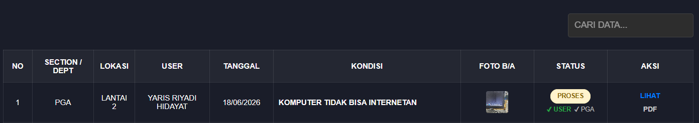

# 🏢 Complain Facility System
> **The smart way to manage facility damage reports and generate maintenance documents automatically.**

---

## 📝 About the Project
**Complain Facility** is built to eliminate traditional, complicated methods of handling facility damage in work and operational environments. This web-based platform integrates the entire end-to-end complaint reporting workflow, connecting **Users** (reporters), **Technicians** (executors), and **Management / PGA (Property & General Affairs)** digitally and transparently.

No more lost, misplaced, or forgotten reports. Through this system, the status of each repair ticket can be monitored in *real-time*, backed by valid visual documentation, and equipped with a digital signature feature to ensure accountability before generating official PDF-based maintenance reports automatically.

---

## 🚀 System Workflow & Application Screenshots

The following is a detailed explanation of the **Complain Facility** system's operational workflow, accompanied by visual representations of each stage of the process:

### 1. Authentication System & Access Control (Login & Registration)
Before accessing the system, users must verify their identity through the authentication page. This system supports multi-role access with strict privilege boundaries (Standard User, Technician, and PGA).

* **Workflow:** Users input their username and password. The system validates the account credentials and redirects them to the appropriate dashboard based on their role. For new users (employees), registration is explicitly restricted to the *Standard User* role.

#### A. Login Page
Registered users can directly input their *Username / Email* and *Password*. A "Registration" button option is available at the bottom for new users, along with a dark/light mode toggle icon in the bottom-left corner for visual interface comfort.

#### B. Registration Page (New Account Creation)
The registration form for new users is designed to be clean and secure. Users are required to fill out their *Username*, *Full Name* (according to the company ID Card), *Active Email*, *Password*, and *Confirm Password* to prevent typos. In this system, self-registration is locked to assign the **Standard User** role by default, preventing unauthorized administrative role selection to maintain system security.

#### C. Welcome Pop-up & Quick User Guide
Upon successful login, an interactive *pop-up modal* appears as an official welcome message personalized with the user's name. In addition to greeting the user, this *modal* serves as a *Quick Start Guide* to ensure they understand crucial steps, such as form submission, mandatory *Before* photo attachments, the digital signature (TTD) process, and how to download the PDF report once verified by the PGA team. Users simply click the **"SAYA MENGERTI"** (I Understand) button to close the guide and begin using the application.

---

### 2. Submitting a New Complaint by User (Reporting & Initial Verification Stage)
Users who encounter damaged facilities can submit a report independently in seconds and immediately complete it with initial authorization to queue the ticket for repair.

* **Workflow:** The user opens the complaint form menu, inputs the specific location details and damage description, and provides their digital signature as the reporter. Once saved, the report is registered on the main table with a **PROSES** (In Progress) status, and the system automatically prompts a technician contact selection to let the user send an instant notification via WhatsApp.

#### A. Form Submission & User Digital Signature (TTD)
While filling out the form, the user provides descriptions regarding the facility damage in the designated field. Before hitting the save button, the user must provide a Digital Signature in the **TTD USER (PELAPOR)** canvas box as official validation for the submitted complaint.

#### B. Main Table Monitoring with "PROSES" Status
Once the form is successfully saved, the complaint entry immediately appears in the monitoring table marked with a yellow status badge labeled **PROSES**. The status column also displays a green check indicator (`✓ USER`), signifying that the reporter has successfully signed off on the ticket.

---

## 🛡️ Copyright
This project, including its code architecture, database schema, interface design, and all enclosed assets, is private property. It is strictly prohibited to redistribute, modify, or use this system for commercial purposes without explicit written permission from the rightful owner.

**Copyright © 2026 [yarisriyadi]. All rights reserved.**

---

  <i>"Complain Facility: A simple solution for keeping facilities in prime condition."</i>

