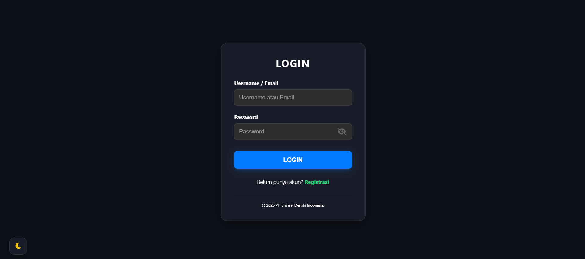
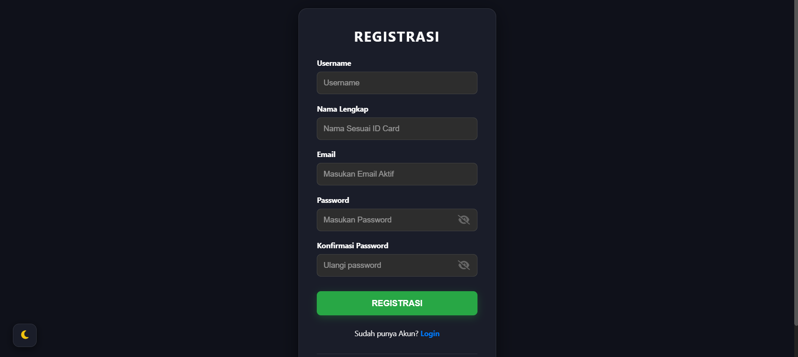
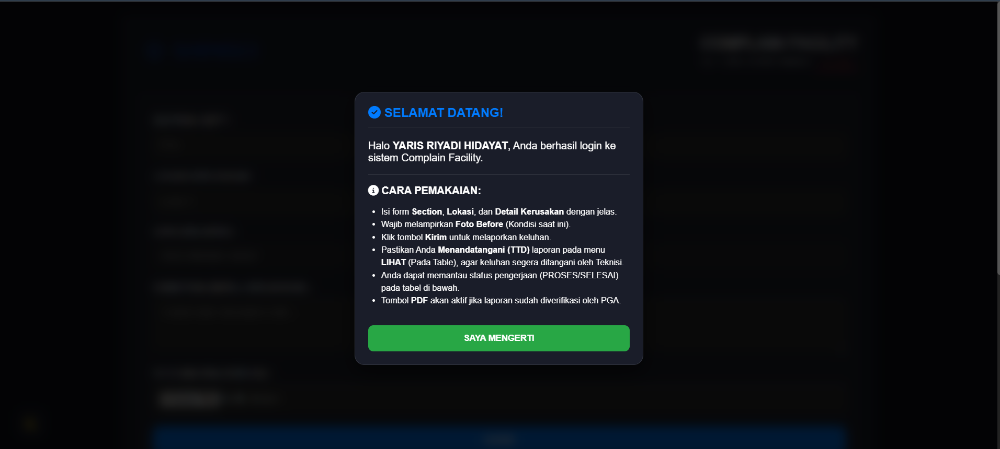
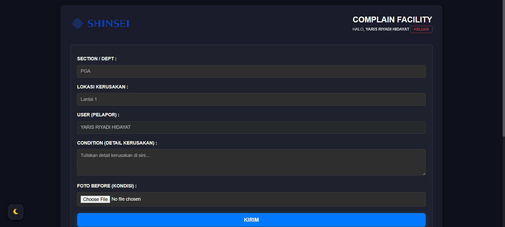
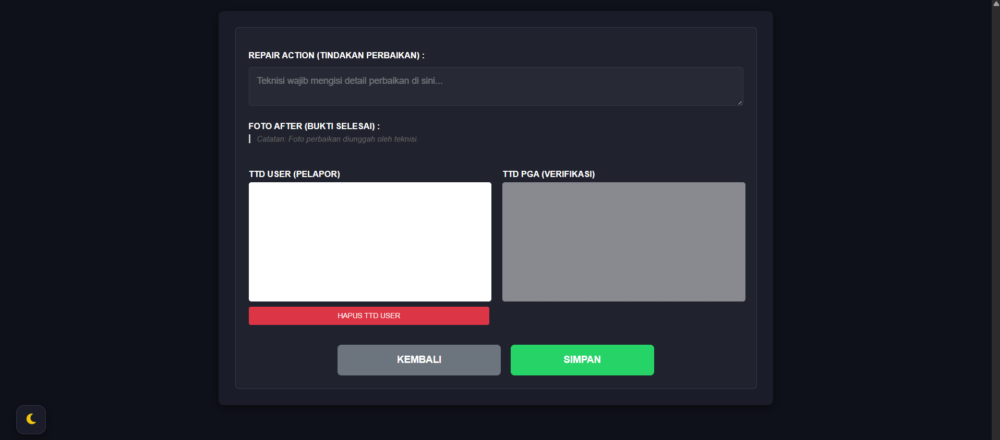

# 🏢 Complain Facility System
> **Cara cerdas kelola laporan kerusakan dan bikin dokumen maintenance otomatis.**

---

## 📝 Tentang Proyek
**Complain Facility** hadir untuk membuang cara lama yang ribet dalam menangani kerusakan fasilitas di lingkungan kerja maupun operasional. Platform berbasis web ini mengintegrasikan seluruh alur pelaporan keluhan secara *end-to-end*, menghubungkan **User** (pelapor), **Teknisi** (eksekutor), hingga **Manajemen / PGA (Property & General Affairs)** secara digital dan transparan.

Enggak ada lagi laporan yang hilang, terselip, atau terlupakan. Melalui sistem ini, status setiap tiket perbaikan dapat dipantau secara *real-time*, didukung bukti dokumentasi visual yang valid, serta dilengkapi dengan fitur tanda tangan digital untuk memastikan akuntabilitas kerja sebelum sistem menghasilkan dokumen formal berbasis PDF secara otomatis.

---

## 🚀 Alur Kerja Sistem & Screenshot Aplikasi

Berikut adalah penjelasan detail mengenai alur operasional sistem **Complain Facility**, lengkap dengan representasi visual dari setiap tahapan proses aplikasi:

### 1. Sistem Autentikasi & Hak Akses (Login & Registrasi)
Sebelum masuk ke sistem, pengguna harus mengonfirmasi identitas mereka melalui halaman autentikasi. Sistem ini mendukung multi-role dengan batasan hak akses yang ketat (User Biasa, Teknisi, dan PGA).

* **Alur:** Pengguna memasukkan username dan password. Sistem memvalidasi akun dan mengarahkan pengguna ke dashboard yang sesuai dengan role mereka. Bagi pengguna baru (karyawan), registrasi dibatasi secara khusus hanya untuk role *Standard User*.

#### A. Halaman Login
Pengguna yang sudah terdaftar dapat langsung memasukkan *Username / Email* beserta *Password*. Terdapat juga opsi tombol "Registrasi" di bagian bawah jika belum memiliki akun, serta ikon mode gelap/terang di pojok kiri bawah untuk kenyamanan visual antarmuka.

#### B. Halaman Registrasi (Pendaftaran Akun Baru)
Untuk pengguna baru, formulir registrasi dirancang bersih dan aman. Pengguna diwajibkan mengisi *Username*, *Nama Lengkap* (sesuai dengan ID Card perusahaan), *Email Aktif*, serta *Password* dan *Konfirmasi Password* untuk menghindari kekeliruan pengetikan. Pada sistem ini, pendaftaran mandiri dikunci secara otomatis agar pengguna baru langsung mendapatkan hak akses sebagai **User Biasa (Standard User)** tanpa bisa memilih role administrasi secara bebas demi menjaga keamanan sistem.

#### C. Pop-up Sambutan & Panduan Penggunaan (Selamat Datang)
Setelah berhasil melakukan login, sistem akan menampilkan jendela *pop-up modal* interaktif sebagai sambutan selamat datang resmi yang dipersonalisasi dengan nama pengguna. Selain menyapa, *modal* ini berfungsi sebagai panduan cepat (*Quick Start Guide*) agar pengguna memahami langkah-langkah penting seperti pengisian form, kewajiban melampirkan foto *Before*, proses Tanda Tangan Digital (TTD), hingga cara mengunduh laporan PDF setelah diverifikasi oleh tim PGA. Pengguna cukup menekan tombol **"SAYA MENGERTI"** untuk menutup panduan dan mulai menggunakan aplikasi.

---

### 2. Pengajuan Keluhan Baru oleh User (Tahap "Lapor" & Verifikasi Awal)
User yang menemukan fasilitas rusak dapat membuat laporan secara mandiri dan langsung melengkapinya dengan otorisasi awal agar tiket masuk ke dalam antrean pengerjaan.

* **Alur:** User membuka menu pengisian keluhan, memasukkan detail lokasi serta deskripsi kerusakan, dan memberikan tanda tangan digital sebagai pelapor. Setelah disimpan, laporan akan terdaftar pada tabel utama dengan status **PROSES**, dan sistem secara otomatis memunculkan pilihan kontak teknisi agar user bisa segera mengirimkan notifikasi via WhatsApp.

#### A. Pengisian Formulir & Tanda Tangan Digital (TTD) User
Saat mengisi formulir, user memberikan deskripsi kerusakan pada fasilitas di kolom yang disediakan. Sebelum menekan tombol simpan, user diwajibkan membubuhkan Tanda Tangan Digital pada kolom **TTD USER (PELAPOR)** sebagai bukti sah pelaporan keluhan.

#### B. Monitoring Tabel Utama dengan Status "PROSES"
Setelah formulir berhasil disimpan, data keluhan tersebut langsung masuk ke dalam tabel monitoring dengan tanda status berwarna kuning bertuliskan **PROSES**. Pada kolom status ini juga terlihat indikator centang hijau (`✓ USER`) yang menandakan bahwa pihak pelapor telah berhasil memberikan tanda tangannya.

#### C. Pengiriman Notifikasi Laporan ke WhatsApp Teknisi
Sesaat setelah pengisian form dan pembubuhan tanda tangan selesai dilakukan, sistem akan menampilkan jendela *pop-up modal* interaktif **"Kirim Laporan"**. Pada tahap ini, user diarahkan untuk memilih teknisi yang bertugas (seperti *Pak Martani* atau *Mas Dodik*) untuk mengirimkan rincian notifikasi perbaikan secara langsung melalui aplikasi WhatsApp agar kerusakan segera ditangani.

---

### 3. Manajemen Tiket & Penanganan oleh Teknisi (Tahap "Eksekusi")
Tim teknis menerima laporan dan melakukan tindakan korektif di lapangan berdasarkan skala prioritas.
* **Alur:** Teknisi melihat daftar tiket masuk di dashboard mereka, mengubah status menjadi *In Progress* saat mulai mengecek lokasi, dan melakukan perbaikan fisik. Setelah perbaikan selesai, teknisi wajib mengambil foto hasil kerja (*After*) dan mengunggahnya ke dalam sistem sebagai bukti penyelesaian tugas.